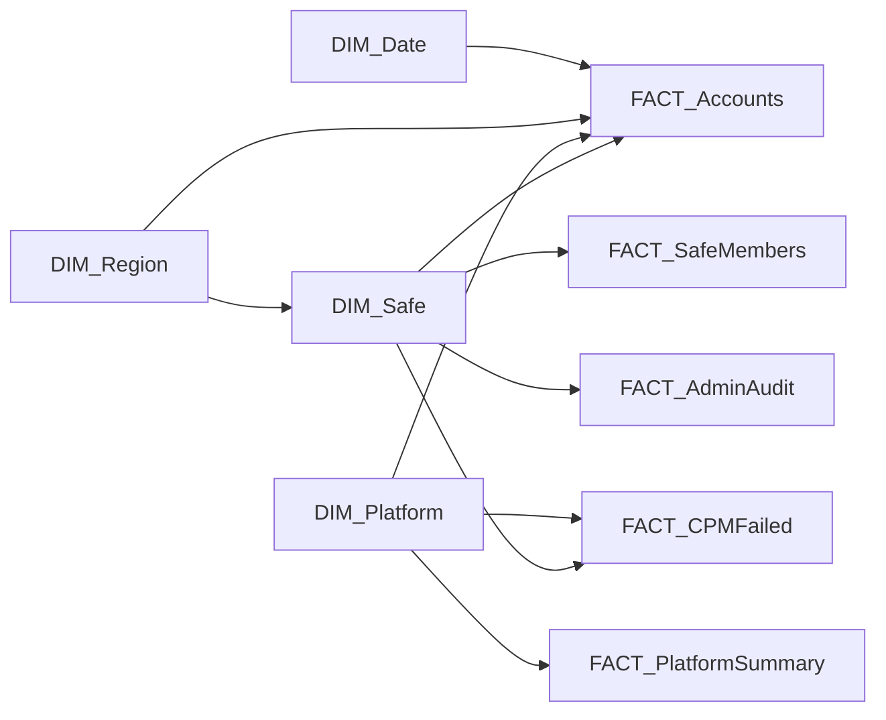

# CyberArk Privilege Cloud — Power BI Dashboard Guide (V6)

Complete setup guide for building the dashboard from the **V6 script** CSV output.

> **What changed vs. the original guide**
> - Removed data sources (no longer produced by the script): `FACT_SystemHealth`,
>   `FACT_PortalHealth`, `FACT_ActiveSessions`, `DIM_Connector`, `FACT_ComponentHealth`,
>   and `FACT_RiskFindings`.
> - Retained from the safe-members stage: `FACT_SafeMembers` and `FACT_AdminAudit`.
> - New `SafeType` column on `DIM_Safe` and `FACT_Accounts`
>   (`Personal Admin` / `Shared Admin` / `Standard Business` / `System/Default`).
> - Output is now **14 CSVs**. Pages reduced from 8 to 7.

---

## Data Sources (14 CSVs)

| Dimension tables | Fact tables |
|---|---|
| `DIM_Date` | `FACT_Accounts` |
| `DIM_Region` | `FACT_Users` |
| `DIM_Platform` | `FACT_Groups` |
| `DIM_Safe` | `FACT_CPMFailed` |
| | `FACT_PlatformSummary` |
| | `FACT_VaultConnectivity` |
| | `FACT_SafeMembers` *(opt-in)* |
| | `FACT_AdminAudit` *(opt-in)* |
| | `FACT_OnboardingTrend` |
| | `FACT_MetricsSummary` |

> `FACT_SafeMembers` and `FACT_AdminAudit` only contain rows when the script is run
> with `$CollectSafeMembers = $true`. When off, they are written as header-only CSVs
> so the model still loads.

---

## Step 1: Import Data

1. Open **Power BI Desktop** → `Get Data` → `Text/CSV`
2. Navigate to your `Latest/` folder
3. Import each CSV file one by one (or use `Get Data → Folder` and point to `Latest/`)
4. In Power Query Editor for each table:
   - Ensure `DateKey`, `CreatedDate`, `LastChangeDate` etc. are typed as **Date**
   - Ensure numeric columns (`NumberOfAccounts`, `DaysSinceChange`, etc.) are typed as **Whole Number** or **Decimal**
   - Ensure boolean-like columns (`TRUE`/`FALSE` strings) are kept as **Text** (we'll handle them in DAX)
5. Click **Close & Apply**

> **Tip**: Use `Get Data → Folder`, select `Latest/`, click **Combine & Transform**. This loads all CSVs at once. Rename each query to match the filename (remove `.csv`).

---

## Step 2: Relationships (Star Schema)

Go to **Model View** and create these relationships:

| # | From Table | From Column | To Table | To Column | Cardinality | Cross-filter |
|---|-----------|-------------|----------|-----------|-------------|-------------|
| 1 | `FACT_Accounts` | `SafeName` | `DIM_Safe` | `SafeName` | Many → One | Both |
| 2 | `FACT_Accounts` | `PlatformID` | `DIM_Platform` | `PlatformID` | Many → One | Both |
| 3 | `FACT_Accounts` | `Region` | `DIM_Region` | `RegionKey` | Many → One | Both |
| 4 | `FACT_Accounts` | `CreatedDate` | `DIM_Date` | `DateKey` | Many → One | Single |
| 5 | `FACT_CPMFailed` | `PlatformID` | `DIM_Platform` | `PlatformID` | Many → One | Single |
| 6 | `FACT_CPMFailed` | `SafeName` | `DIM_Safe` | `SafeName` | Many → One | Single |
| 7 | `FACT_SafeMembers` | `SafeName` | `DIM_Safe` | `SafeName` | Many → One | Single |
| 8 | `FACT_AdminAudit` | `SafeName` | `DIM_Safe` | `SafeName` | Many → One | Single |
| 9 | `FACT_PlatformSummary` | `PlatformID` | `DIM_Platform` | `PlatformID` | Many → One | Single |
| 10 | `DIM_Safe` | `Region` | `DIM_Region` | `RegionKey` | Many → One | Single |

> [!IMPORTANT]
> Relationships #1, #2, #3 should have **Cross-filter direction = Both**. All others **Single**.

> [!NOTE]
> **`FACT_OnboardingTrend` is intentionally NOT related to `DIM_Date`.** `DIM_Date`
> has one row per day, so its `MonthKey` is not unique and Power BI would reject a
> many-to-one join. The onboarding visuals use `FACT_OnboardingTrend[Month]` directly
> on their axis, so no relationship is needed. `FACT_VaultConnectivity` is also
> standalone (report-scoped tables, filtered by their own columns).



---

## Step 3: DAX Measures

Create a new table called **_Measures** (`Modeling` → `New Table` → `_Measures = {BLANK()}`). Put all measures here.

### 3.1 Core Account Metrics

```dax
Total Accounts = COUNTROWS(FACT_Accounts)

Business Accounts = 
CALCULATE(COUNTROWS(FACT_Accounts), FACT_Accounts[IsDefaultSafe] = FALSE)

Compliant Accounts = 
CALCULATE(COUNTROWS(FACT_Accounts), 
    FACT_Accounts[ComplianceStatus] = "Compliant",
    FACT_Accounts[IsDefaultSafe] = FALSE)

Non-Compliant Accounts = 
CALCULATE(COUNTROWS(FACT_Accounts), 
    FACT_Accounts[ComplianceStatus] = "Non-Compliant",
    FACT_Accounts[IsDefaultSafe] = FALSE)

Pending Accounts = 
CALCULATE(COUNTROWS(FACT_Accounts), 
    FACT_Accounts[ComplianceStatus] = "Pending/Unknown",
    FACT_Accounts[IsDefaultSafe] = FALSE)

Compliance Rate % = 
DIVIDE([Compliant Accounts], [Business Accounts], 0) * 100

APM Accounts = 
CALCULATE(COUNTROWS(FACT_Accounts), 
    FACT_Accounts[AutoManaged] = TRUE,
    FACT_Accounts[IsDefaultSafe] = FALSE)

MPM Accounts = 
CALCULATE(COUNTROWS(FACT_Accounts), 
    FACT_Accounts[AutoManaged] = FALSE,
    FACT_Accounts[IsDefaultSafe] = FALSE)

APM Rate % = 
DIVIDE([APM Accounts], [Business Accounts], 0) * 100
```

### 3.2 Rotation & Staleness

```dax
Rotation Overdue = 
CALCULATE(COUNTROWS(FACT_Accounts), 
    FACT_Accounts[RotationOverdue] = TRUE,
    FACT_Accounts[IsDefaultSafe] = FALSE)

Stale Accounts = 
CALCULATE(COUNTROWS(FACT_Accounts), 
    FACT_Accounts[IsStale] = TRUE,
    FACT_Accounts[IsDefaultSafe] = FALSE)

Never Verified = 
CALCULATE(COUNTROWS(FACT_Accounts), 
    FACT_Accounts[VerifyStatus] = "Never Verified",
    FACT_Accounts[IsDefaultSafe] = FALSE)

Avg Password Age Days = 
CALCULATE(
    AVERAGE(FACT_Accounts[DaysSinceChange]),
    FACT_Accounts[IsDefaultSafe] = FALSE,
    NOT(ISBLANK(FACT_Accounts[DaysSinceChange]))
)
```

### 3.3 Safe Metrics (incl. SafeType)

```dax
Total Safes = COUNTROWS(DIM_Safe)

Business Safes = 
CALCULATE(COUNTROWS(DIM_Safe), DIM_Safe[IsDefault] = FALSE)

Empty Safes = 
CALCULATE(COUNTROWS(DIM_Safe), DIM_Safe[IsEmpty] = TRUE, DIM_Safe[IsDefault] = FALSE)

Safes Without CPM = 
CALCULATE(COUNTROWS(DIM_Safe), DIM_Safe[HasCPM] = FALSE, DIM_Safe[IsDefault] = FALSE)

Non-Standard Safe Names = 
CALCULATE(COUNTROWS(DIM_Safe), DIM_Safe[NamingCompliant] = FALSE, DIM_Safe[IsDefault] = FALSE)

Recently Created Safes = 
CALCULATE(COUNTROWS(DIM_Safe), DIM_Safe[RecentlyCreated] = TRUE, DIM_Safe[IsDefault] = FALSE)

Personal Admin Safes = 
CALCULATE(COUNTROWS(DIM_Safe), DIM_Safe[SafeType] = "Personal Admin")

Shared Admin Safes = 
CALCULATE(COUNTROWS(DIM_Safe), DIM_Safe[SafeType] = "Shared Admin")

Standard Business Safes = 
CALCULATE(COUNTROWS(DIM_Safe), DIM_Safe[SafeType] = "Standard Business")
```

### 3.4 User Metrics

```dax
Total Users = COUNTROWS(FACT_Users)

Real Users = 
CALCULATE(COUNTROWS(FACT_Users), FACT_Users[IsComponent] = FALSE)

Active Users = 
CALCULATE(COUNTROWS(FACT_Users), 
    FACT_Users[IsComponent] = FALSE,
    CONTAINSSTRING(FACT_Users[LoginStatus], "Active"))

Dormant Users = 
CALCULATE(COUNTROWS(FACT_Users), 
    FACT_Users[IsComponent] = FALSE,
    CONTAINSSTRING(FACT_Users[LoginStatus], "Dormant"))

Never Logged In Users = 
CALCULATE(COUNTROWS(FACT_Users), 
    FACT_Users[IsComponent] = FALSE,
    FACT_Users[LoginStatus] = "Never Logged In")

Active User Rate % = 
DIVIDE([Active Users], [Real Users], 0) * 100
```

### 3.5 CPM & Platform Metrics

```dax
CPM Failed Count = COUNTROWS(FACT_CPMFailed)

CPM Success Rate % = 
VAR _managed = CALCULATE(COUNTROWS(FACT_Accounts), 
    FACT_Accounts[AutoManaged] = TRUE, FACT_Accounts[IsDefaultSafe] = FALSE)
VAR _success = CALCULATE(COUNTROWS(FACT_Accounts), 
    FACT_Accounts[AutoManaged] = TRUE, 
    FACT_Accounts[ComplianceStatus] = "Compliant",
    FACT_Accounts[IsDefaultSafe] = FALSE)
RETURN DIVIDE(_success, _managed, 0) * 100
```

### 3.6 Vault Connectivity Metrics

```dax
Vault Components Total = COUNTROWS(FACT_VaultConnectivity)

Vault Components Connected = 
CALCULATE(COUNTROWS(FACT_VaultConnectivity), FACT_VaultConnectivity[IsLoggedOn] = "TRUE")

Vault Connectivity % = 
DIVIDE([Vault Components Connected], [Vault Components Total], 0) * 100
```

### 3.7 Onboarding Trend

```dax
Recently Onboarded Accounts = 
CALCULATE(COUNTROWS(FACT_Accounts),
    FACT_Accounts[RecentlyOnboarded] = TRUE,
    FACT_Accounts[IsDefaultSafe] = FALSE)

Cumulative Accounts = 
CALCULATE(
    SUM(FACT_OnboardingTrend[AccountsOnboarded]),
    FILTER(ALL(FACT_OnboardingTrend),
        FACT_OnboardingTrend[Month] <= MAX(FACT_OnboardingTrend[Month])))

Cumulative Safes = 
CALCULATE(
    SUM(FACT_OnboardingTrend[SafesCreated]),
    FILTER(ALL(FACT_OnboardingTrend),
        FACT_OnboardingTrend[Month] <= MAX(FACT_OnboardingTrend[Month])))

Avg Monthly Onboarding = AVERAGE(FACT_OnboardingTrend[AccountsOnboarded])
```

### 3.8 Admin/Breakglass Audit (opt-in)

```dax
Admin Groups Compliance % = 
VAR _total = COUNTROWS(FACT_AdminAudit)
VAR _full = CALCULATE(COUNTROWS(FACT_AdminAudit), FACT_AdminAudit[PermissionLevel] = "Full")
RETURN DIVIDE(_full, _total, 0) * 100

Admin Groups Missing = 
CALCULATE(COUNTROWS(FACT_AdminAudit), FACT_AdminAudit[GroupExists] = "No")
```

### 3.9 Conditional Formatting Helpers

```dax
Compliance Color = 
SWITCH(TRUE(),
    [Compliance Rate %] >= 90, "#10B981",
    [Compliance Rate %] >= 70, "#F59E0B",
    "#EF4444")

Connectivity Color = 
SWITCH(TRUE(),
    [Vault Connectivity %] >= 95, "#10B981",
    [Vault Connectivity %] >= 80, "#F59E0B",
    "#EF4444")
```

---

## Step 4: Dashboard Pages (7)

### Color Palette

| Purpose | Hex |
|---------|-----|
| Primary (CyberArk Blue) | `#1E3A5F` |
| Accent (Teal) | `#0EA5E9` |
| Success / Compliant | `#10B981` |
| Warning / Overdue | `#F59E0B` |
| Error / Failed | `#EF4444` |
| Neutral / Default | `#64748B` |
| Background | `#0F172A` |
| Card Background | `#1E293B` |
| Text | `#F8FAFC` |
| Subtext | `#94A3B8` |

> Set page background to `#0F172A` (dark mode) for all pages.

---

### Page 1: 🏠 Executive Summary

**Purpose**: Single-glance KPI overview for leadership.

| # | Visual Type | Fields | Notes |
|---|------------|--------|-------|
| 1 | **Card** | `[Business Accounts]` | |
| 2 | **Card** | `[Business Safes]` | |
| 3 | **Card** | `[Compliance Rate %]` | green ≥90, amber ≥70, red <70 |
| 4 | **Card** | `[CPM Failed Count]` | green =0, red >0 |
| 5 | **Card** | `[Active Users]` | |
| 6 | **Card** | `[Rotation Overdue]` | amber/red if > 0 |
| 7 | **Doughnut** | Legend: `ComplianceStatus`, Values: count | Filter `IsDefaultSafe = FALSE` |
| 8 | **Stacked Bar** | Axis: `DIM_Region[RegionKey]`, Legend: `Tier`, Values: count | Filter `IsDefaultSafe = FALSE` |
| 9 | **Doughnut** | Legend: `DIM_Safe[SafeType]`, Values: count of SafeName | **NEW** — safe-type split |
| 10 | **Doughnut** | Legend: `MgmtTechnique`, Values: count | APM vs MPM |
| 11 | **Bar** | Axis: `DIM_Safe[SafeName]`, Values: `NumberOfAccounts` | Top 10, `IsDefault = FALSE` |
| 12 | **Multi-row Card** | `[Rotation Overdue]`, `[Stale Accounts]`, `[Non-Standard Safe Names]`, `[Empty Safes]` | red if > 0 |

**Slicers**: `DIM_Region[RegionKey]`, `DIM_Safe[Tier]`, `DIM_Safe[SafeType]`.

---

### Page 2: 📊 Account Inventory & Compliance

| # | Visual Type | Fields |
|---|------------|--------|
| 1 | **Card** | `[Business Accounts]` |
| 2 | **Card** | `[Compliance Rate %]` — conditional |
| 3 | **Card** | `[APM Rate %]` |
| 4 | **Card** | `[Rotation Overdue]` |
| 5 | **Card** | `[Never Verified]` |
| 6 | **Matrix** | Rows `FACT_Accounts[Region]`, Cols `FACT_Accounts[Tier]`, Values count. Filter `IsDefaultSafe = FALSE` |
| 7 | **Stacked Bar** | Axis `OSCategory`, Legend `ComplianceStatus`, Values count |
| 8 | **Clustered Bar** | Axis `Region`, Legend `VerifyStatus`, Values count |
| 9 | **Treemap** | Group `PlatformID`, Values count, tooltip `OSCategory` |
| 10 | **Table** | `Name`, `UserName`, `Address`, `SafeName`, `SafeType`, `PlatformID`, `Region`, `Tier`, `ComplianceStatus`, `DaysSinceChange`, `RotationOverdue`, `IsStale`, `VerifyStatus`. Filter `IsDefaultSafe = FALSE` |

**Slicers**: `DIM_Region[RegionKey]`, `DIM_Safe[Tier]`, `DIM_Safe[SafeType]`, `DIM_Platform[PlatformID]`, `FACT_Accounts[OSCategory]`, `FACT_Accounts[ComplianceStatus]`.

---

### Page 3: 📈 Onboarding Trend & Growth

| # | Visual Type | Fields |
|---|------------|--------|
| 1 | **Card** | `[Recently Onboarded Accounts]` |
| 2 | **Card** | `[Recently Created Safes]` |
| 3 | **Card** | `[Avg Monthly Onboarding]` — decimal |
| 4 | **Card** | `[Business Accounts]` |
| 5 | **Combo Chart** | X `FACT_OnboardingTrend[Month]`, Column `SUM(AccountsOnboarded)`, Line `[Cumulative Accounts]` (secondary axis) |
| 6 | **Bar** | Axis `FACT_OnboardingTrend[Month]`, Values `SUM(SafesCreated)` |
| 7 | **Line** | X `FACT_OnboardingTrend[Month]`, Y `[Cumulative Safes]` |
| 8 | **Stacked Bar** | Axis `FACT_Accounts[CreatedMonth]`, Legend `Region`, Values count. Filter `IsDefaultSafe = FALSE`, `CreatedMonth` not blank |

**Slicers**: `DIM_Region[RegionKey]`, `DIM_Safe[Tier]`.

---

### Page 4: 🔐 Safe Inventory & Naming Compliance

| # | Visual Type | Fields |
|---|------------|--------|
| 1 | **Card** | `[Business Safes]` |
| 2 | **Card** | `[Empty Safes]` — amber if > 0 |
| 3 | **Card** | `[Safes Without CPM]` — red if > 0 |
| 4 | **Card** | `[Non-Standard Safe Names]` — red if > 0 |
| 5 | **Card** | `[Recently Created Safes]` |
| 6 | **Pie** | Legend `DIM_Safe[Region]`, Values count. Filter `IsDefault = FALSE` |
| 7 | **Stacked Bar** | Axis `DIM_Safe[SafeType]`, Legend `NamingCompliant`, Values count. Filter `IsDefault = FALSE` — **NEW SafeType axis** |
| 8 | **Bar** | Axis `DIM_Safe[SafeName]`, Values `NumberOfAccounts`. Top 10, `IsDefault = FALSE` |
| 9 | **Doughnut** | Legend `DIM_Safe[HasCPM]`, Values count. Filter `IsDefault = FALSE` |
| 10 | **Table** | `SafeName`, `SafeType`, `Region`, `Tier`, `ManagingCPM`, `NumberOfAccounts`, `HasCPM`, `IsEmpty`, `NamingCompliant`, `CreatedDate`. Conditional: `NamingCompliant = FALSE` → red |

**Slicers**: `DIM_Region[RegionKey]`, `DIM_Safe[Tier]`, `DIM_Safe[SafeType]`, `DIM_Safe[HasCPM]`, `DIM_Safe[IsEmpty]`.

---

### Page 5: 👥 Users, Groups & Access Governance

| # | Visual Type | Fields |
|---|------------|--------|
| 1 | **Card** | `[Real Users]` |
| 2 | **Card** | `[Active Users]` — green |
| 3 | **Card** | `[Dormant Users]` — amber |
| 4 | **Card** | `[Never Logged In Users]` — red |
| 5 | **Card** | `COUNTROWS(FACT_Groups)` |
| 6 | **Doughnut** | Legend `LoginStatus`, Values count. Filter `IsComponent = FALSE` |
| 7 | **Bar** | Axis `VaultAuth`, Values count |
| 8 | **Pie** | Legend `FACT_Groups[IsDefault]`, Values count |
| 9 | **Table** | `UserName`, `LoginStatus`, `DaysSinceLogin`, `Source`, `Enabled`, `Suspended`. Filter `IsComponent = FALSE`, sort `DaysSinceLogin` desc |

**Slicers**: `FACT_Users[LoginStatus]`, `FACT_Users[UserType]`.

---

### Page 6: 🖥️ Vault Connectivity

**Purpose**: CPM / PSM / AIM component logon status against the vault.
(This page replaces the old multi-source *Infrastructure* page; System Health, Portal
Health, Connector servers, Component Health and Active Sessions are no longer collected.)

| # | Visual Type | Fields |
|---|------------|--------|
| 1 | **Card** | `[Vault Components Total]` |
| 2 | **Card** | `[Vault Components Connected]` |
| 3 | **Card** | `[Vault Connectivity %]` — conditional color |
| 4 | **Clustered Bar** | Axis `FACT_VaultConnectivity[ComponentType]`, Values count, Legend `IsLoggedOn` |
| 5 | **Table** | `ComponentType`, `InstanceIP`, `VaultUserName`, `ComponentVersion`, `IsLoggedOn`, `LastLogonDate`. Conditional: `IsLoggedOn = FALSE` → red row |

**Slicer**: `FACT_VaultConnectivity[ComponentType]` (CPM / SessionManagement / AIM).

---

### Page 7: 🔍 CPM Operations & Failures

| # | Visual Type | Fields |
|---|------------|--------|
| 1 | **Card** | `[CPM Failed Count]` — red if > 0 |
| 2 | **Card** | `[CPM Success Rate %]` — conditional |
| 3 | **Card** | `[APM Accounts]` |
| 4 | **Card** | `COUNTROWS(FACT_PlatformSummary)` |
| 5 | **Bar** | Axis `FACT_PlatformSummary[PlatformID]`, Values `FailedCount`. Top 10, sort desc |
| 6 | **Clustered Bar** | Axis `PlatformID`, Values `ManagedCount` + `UnmanagedCount`. Top 10 |
| 7 | **Stacked Bar** | Axis `FACT_CPMFailed[Region]`, Values count, Legend `CPMStatus` |
| 8 | **Doughnut** | Legend `FACT_CPMFailed[Tier]`, Values count |
| 9 | **Table** | `AccountName`, `Address`, `PlatformID`, `SafeName`, `Region`, `Tier`, `CPMStatus`, `ManualReason`, `LastModified`, `LastVerified`. Conditional on `CPMStatus` |

**Slicers**: `DIM_Platform[PlatformID]`, `DIM_Region[RegionKey]`, `DIM_Safe[Tier]`.

---

### Page 8 *(opt-in)*: 🧾 Safe Membership & Admin Audit

> [!NOTE]
> Only populated when the script runs with `$CollectSafeMembers = $true`. Uses
> `FACT_SafeMembers` and `FACT_AdminAudit`. (The former "Risk & Security Audit"
> risk-finding visuals were removed with `FACT_RiskFindings`.)

| # | Visual Type | Fields |
|---|------------|--------|
| 1 | **Card** | `COUNTROWS(FACT_SafeMembers)` — total member assignments |
| 2 | **Card** | `[Admin Groups Compliance %]` |
| 3 | **Card** | `[Admin Groups Missing]` — red if > 0 |
| 4 | **Stacked Bar** | Axis `FACT_SafeMembers[Region]`, Legend `MemberType` (User/Group), Values count |
| 5 | **Doughnut** | Legend `FACT_SafeMembers[MemberCategory]`, Values count |
| 6 | **Table: Admin Group Audit** | `SafeName`, `GroupName`, `GroupExists`, `PermissionLevel`, `MissingPermissions`. Conditional: `GroupExists = No` or `PermissionLevel = Partial` → amber/red |
| 7 | **Table: Members detail** | `SafeName`, `MemberName`, `MemberType`, `IsSafeManager`, `MemberCategory`, `Permissions`, `MembershipExpirationDate`. Filter `IsDefaultSafe = FALSE` |

**Slicers**: `DIM_Region[RegionKey]`, `DIM_Safe[Tier]`, `DIM_Safe[SafeType]`, `FACT_SafeMembers[MemberType]`.

---

## Step 5: Global Slicer Sync

1. **View** → **Sync Slicers**.
2. Sync `DIM_Region[RegionKey]` across Pages 1, 2, 3, 4, 7, 8.
3. Sync `DIM_Safe[Tier]` across Pages 1, 2, 3, 4, 7, 8.
4. Sync `DIM_Safe[SafeType]` across Pages 1, 2, 4, 8.
5. Sync `DIM_Platform[PlatformID]` across Pages 2 and 7.

---

## Step 6: Page Navigation

Insert → Buttons → Navigator → **Page navigator** (icon-based vertical sidebar, dark background,
active page in accent `#0EA5E9`):
- 🏠 Executive Summary
- 📊 Account Compliance
- 📈 Onboarding Trend
- 🔐 Safe Inventory
- 👥 Users & Groups
- 🖥️ Vault Connectivity
- 🔍 CPM Operations
- 🧾 Safe Membership *(opt-in)*

---

## Step 7: Formatting Checklist

- [ ] Page background: `#0F172A`
- [ ] Card backgrounds: `#1E293B`, 8px radius
- [ ] Card titles: 10pt `#94A3B8`; values 24–28pt `#F8FAFC` bold
- [ ] Chart backgrounds transparent; axis labels `#94A3B8`; data labels `#F8FAFC`
- [ ] Gridlines `#334155`
- [ ] Table headers `#1E3A5F` bg, white text; alt rows `#1E293B` / `#0F172A`
- [ ] Slicers: dropdown, dark bg, white text
- [ ] Last-refresh card: `MAX(FACT_Accounts[ExtractDate])`
- [ ] Page title: 16pt bold `#F8FAFC`, top-left

---

## Quick Reference: Which Table Feeds Which Page

| Page | Primary Tables | Slicer Tables |
|------|---------------|---------------|
| 1 - Executive | `FACT_Accounts`, `DIM_Safe`, `DIM_Region` | `DIM_Region`, `DIM_Safe` |
| 2 - Accounts | `FACT_Accounts`, `DIM_Platform` | `DIM_Region`, `DIM_Safe`, `DIM_Platform` |
| 3 - Onboarding | `FACT_OnboardingTrend`, `FACT_Accounts` | `DIM_Region`, `DIM_Safe` |
| 4 - Safes | `DIM_Safe` | `DIM_Region`, `DIM_Safe` |
| 5 - Users | `FACT_Users`, `FACT_Groups` | `FACT_Users` |
| 6 - Vault Connectivity | `FACT_VaultConnectivity` | `FACT_VaultConnectivity` |
| 7 - CPM | `FACT_CPMFailed`, `FACT_PlatformSummary` | `DIM_Platform`, `DIM_Region` |
| 8 - Safe Membership *(opt-in)* | `FACT_SafeMembers`, `FACT_AdminAudit` | `DIM_Region`, `DIM_Safe` |
